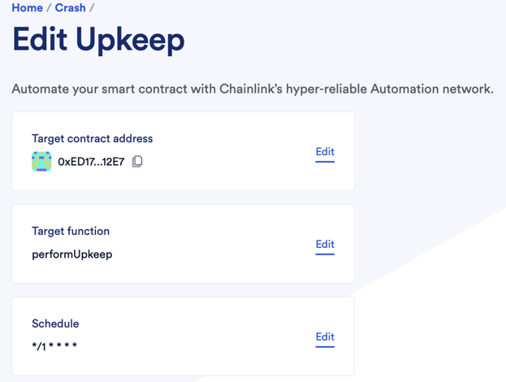

#Crash!

Inspired by the gambling game named "Crash", now built and run on the blockchain fully automated.

Successfully deployed and tested on the [Goerli Testnet](https://goerli.etherscan.io/address/0xed17124c88e554f1ca34a4099988586891e012e7
).


##Requirements
- [git](https://git-scm.com/book/en/v2/Getting-Started-Installing-Git)
- [Nodejs](https://nodejs.org/en/)
- [Yarn](https://yarnpkg.com/getting-started/install)
- [Hardhat](https://hardhat.org/hardhat-runner)

##Installation
```
git clone https://github.com/
cd 
yarn
```


##Usage
###Deploying
```
yarn hardhat deploy
```

###Deploying on Testnet
```
yarn hardhat deploy --network goerli
```

###Testing
```
yarn hardhat test
```

###Test Coverage
```
yarn hardhat coverage
```

##Environment Variables
You must set up your own `GOERLI_RPC_URL` and `PRIVATE_KEY` as environment variables.  Add to your `.env` file.  

##Chainlink VRF & Automation
[Chainlink VRF](https://vrf.chain.link/)

You must get a subscriptionId in order for the contract to receive random numbers.
You need to **fund the subscription with LINK** and connect your deployed contract to it.

[Chainlink Automation](https://automation.chain.link/new)
This is used to automatically monitor and update the state of the game.

Use `Time-based` automation and use these settings:

The target function must be `performUpkeep`

**Fund with LINK**

##Gas cost estimation
To get gas estimation, you need `COINMARKETCAP_API_KEY` environment variable from [CoinMarketCap](https://pro.coinmarketcap.com/signup)

##Etherscan auto-verification
The contract can be verified automatically once deployed if you have an [API Key](https://etherscan.io/myapikey) from Etherscan.  Save the key as an environment variable named `ETHERSCAN_API_KEY`.